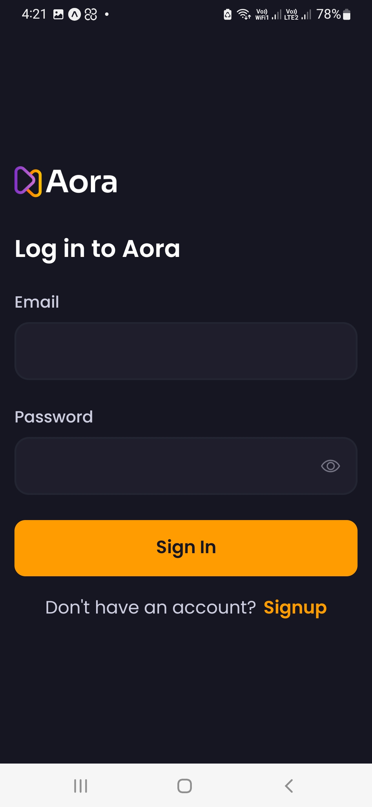
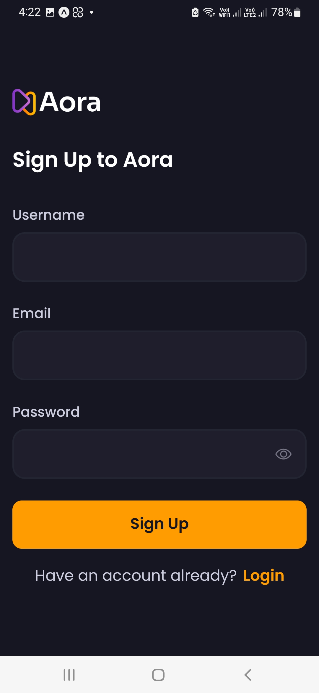
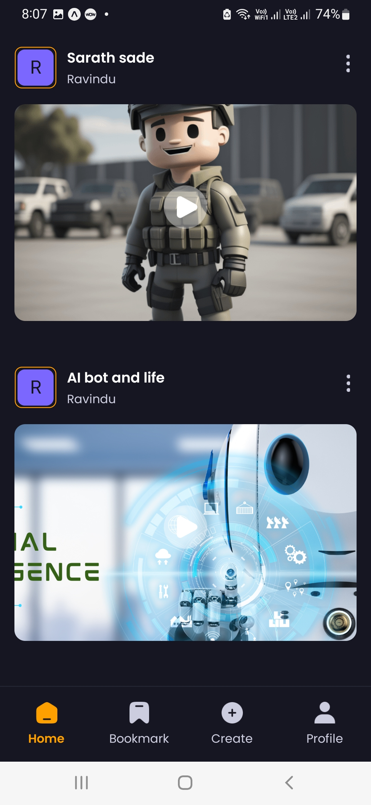

## Aora React Native Social App

## <a name="tech-stack">⚙️ Tech Stack</a>

- React Native
- Expo
- Nativewind
- Animatable
- Appwrite

## <a name="features">🔋 Features</a>

👉 **Onboarding Screen**: Engaging graphics and clear instructions welcome users to the app.

👉 **Robust Authentication & Authorization System**: Secure email login safeguards user accounts.

👉 **Dynamic Home Screen with Animated Flat List**: Smoothly animated flat list showcases the latest videos for seamless browsing.

👉 **Pull-to-Refresh Functionality**: Users can refresh content with a simple pull gesture for up-to-date information.

👉 **Full-Text Search Capability**: Efficiently search through videos with real-time suggestions and instant results.

👉 **Tab Navigation**: Navigate between sections like Home, Search, and Profile with ease using tab navigation.

👉 **Post Creation Screen for Uploading Media**: Upload video and image posts directly from the app with integrated media selection.

👉 **Profile Screen with Detailed Insights**: View account details and activity, including uploaded videos and follower count, for a personalized experience.

👉 **Responsiveness**: Smooth performance and adaptability across various devices and screen sizes for a consistent user experience.

👉 **Animations**: Dynamic animations using the Animatable library to enhance user interaction and engagement throughout the app's UI.

and many more, including code architecture and reusability 

## <a name="quick-start">🤸 Quick Start</a>

Follow these steps to set up the project locally on your machine.

**Prerequisites**

Make sure you have the following installed on your machine:

- [Git](https://git-scm.com/)
- [Node.js](https://nodejs.org/en)
- [npm](https://www.npmjs.com/) (Node Package Manager)

**Cloning the Repository**

```bash
git clone https://github.com/ravindudinushan/Aora-React-Native-App.git
cd aora
```
**Installation**

Install the project dependencies using npm:

```bash
npm install
```

**Running the Project**

```bash
npx expo start
```

**Expo Go**

Download the [Expo Go](https://expo.dev/go) app onto your device, then use it to scan the QR code from Terminal and run.

## 🕸️ Screen Shots</a>
<div style="display: flex; flex-direction: 'row';">







</div>